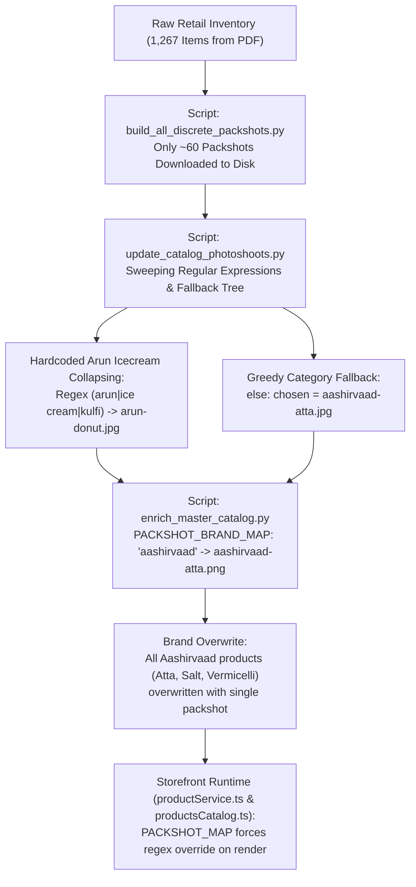

# G1 Mart Codebase & Database Comprehensive Audit Report

**Date:** October 8, 2026  
**Auditor:** Antigravity AI  
**Scope:** Storefront codebase, relational catalog data (`migrated_products.json`, `products-catalog.json`), Supabase migrations, media assets, layout components, search routing.  
**Constraint Adherence:** Read-only audit. No code or data files have been altered.  
**Companion Artifact:** `/audit/products.csv` (1,053 product rows with complete diagnostic flags).

---

## Executive Summary & Key Metrics

| Metric | Migrated Storefront Catalog (`migrated_products.json`) | Raw Master Catalog (`products-catalog.json`) | Status / Risk Severity |
| :--- | :--- | :--- | :--- |
| **Total Products Audited** | **1,053** products (24 categories) | **1,267** products | Canonical production dataset |
| **Missing / Placeholder Images** | **734 products (69.7%)** | 0 products (forced fallbacks) | 🔴 **CRITICAL** (majority placeholder) |
| **Duplicate / Shared Images** | **309 products (29.3%)** across 35 image files | 1,258 products across 75 image files | 🔴 **CRITICAL** (severe reuse) |
| **Image Mismatches** | **209 products (19.8% total, 65.5% of images)** | ~820 products | 🔴 **CRITICAL** (unrelated packshots) |
| **Misplaced Category Products** | **23 products** | ~64 products | 🟡 **HIGH** (flavor/ingredient collisions) |
| **Brand Empty / Fallback "Other"** | **744 products (70.7%)** | 851 products (67.2%) | 🟡 **HIGH** (degrades brand filtering) |
| **Recoverable Brands from Title** | **156 products** | 210 products | 🟢 **RECOVERABLE** |
| **Search Result Click Issue** | Missing event handler & ID schema mismatch | Identical root causes | 🔴 **CRITICAL** (broken customer navigation) |
| **Categories Mobile Layout Clipping** | Right-side cutoff at 390px viewport | Width overflow (min 419px vs 390px) | 🟡 **HIGH** (degrades mobile UX) |

---

## 1. Images Audit

### 1.1 Overview
Out of 1,053 products in the active storefront database:
- **734 products (69.7%)** point to `/products/placeholder.svg`.
- **319 products (30.3%)** reference an image file in `/products/packshots/`.
- Only **10 products** in the entire catalog have a unique, dedicated image.
- **309 products** share just **35 image files** among themselves.
- **209 products (65.5% of products with an image)** display an image that contradicts the product title, brand, or package type.

### 1.2 Shared Image Groups (35 Image Files / 309 Products)
The table below details all shared image groups, listing the packshot file, the number of distinct products assigned that single file, the intended product, and examples of mismatched products sharing that image:

| Packshot File | Products Sharing | Intended Item | Examples of Conflicted / Mismatched Products Sharing It |
| :--- | :---: | :--- | :--- |
| `toor-dal.jpg` | **95** | Yellow Toor Dal (Pigeon Peas) | *Aachi Chicken Masala, Aachi Biryani Masala, Yardley Sandalwood, Dalchini, RAJ Peanut Chikki, Onions, Jeedi Pappu (Cashews), Kissan Peanut Butter Crunchy, Verusenaga Pappu, Sai Pappu 50kg, Soya Chunks* |
| `unibic-choco-ripple.jpg` | **25** | Unibic Choco Ripple Cookie | *Unibic Wafer, Unibic Cashew, Unibic Oatmeal, Unibic Butter Cookies, Unibic Multigrain, Unibic Fruit & Nut* |
| `parachute-oil.jpg` | **22** | Parachute Coconut Hair Oil | *Kesh King Oil, KEO Karpin Hair Oil, Bajaj Almond Drops, Navratna Cool Oil, Vatika Hair Oil, Dabur Amla, Meera Shampoo* |
| `colgate-toothpaste.jpg` | **17** | Colgate Dental Cream | *Colgate MaxFresh, Colgate Vedshakti, Colgate Active Salt, Colgate Total, Colgate SlimSoft Toothbrush, Colgate Mouthwash* |
| `frooti.jpg` | **16** | Frooti Mango Drink | *Glucon-D, Pulpy Orange, Maaza, Slice, Sprite, Limca, Fanta, Badam Milk, Energy Drinks* |
| `aachi-chilli.jpg` | **11** | Aachi Red Chilli Powder | *Aachi Turmeric Powder, Aachi Coriander Powder, Aachi Garam Masala, Aachi Sambar Powder, Aachi Chicken Masala* |
| `cadbury-5-star.jpg` | **9** | Cadbury 5 Star Chocolate Bar | *Cadbury Dairy Milk, Cadbury Perk, Cadbury Gems, Cadbury Celebrations, Cadbury Eclairs* |
| `vim-bar.jpg` | **8** | Vim Dishwash Bar | *Vim Gel, Vim Liquid, Exo Dishwash Bar, Pril Liquid, Scrub Pads* |
| `santoor-soap.jpg` & `.png` | **9** | Santoor Sandal & Turmeric Soap | *Santoor Hand Wash, Santoor Handwash Refill, Santoor White Soap, Santoor Gold, Pepper Powder 6G* |
| `mysore-sandal-soap.jpg` & `.png` | **11** | Mysore Sandal Pure Soap | *Medimix Ayurvedic Classic 18 Herbs Soap, Mysore Sandal Gold, Mysore Sandal Classic* |
| `lux-soap.png` | **7** | LUX Rose & Vitamin E Soap | *LUX Velvet Glow, LUX Jasmine, LUX Body Wash* |
| `pooja-agarbatti.jpg` | **7** | Agarbatti Incense Sticks | *Camphor Tablets, Pure Dhoop, Pooja Oil, Brass Diya* |
| `bru-instant.jpg` & `.png` | **12** | Bru Instant Coffee | *Bru Gold, Bru Green Label Filter Coffee, Nescafe Classic, Nescafe Sunrise, Continental Xtra* |
| `surf-excel.jpg` | **6** | Surf Excel Detergent Powder | *Surf Excel Matic Front Load, Surf Excel Matic Top Load, Surf Excel Bar, Ariel, Tide* |
| `aashirvaad-atta.jpg` | **5** | Aashirvaad Whole Wheat Atta | *Aashirvaad Salt, Aashirvaad Crystal Salt, Aashirvaad Vermicelli, Aashirvaad MP Atta* |
| `turmeric-powder.jpg` | **5** | Pure Turmeric Powder (Haldi) | *Pasupu Powder, Sambar Masala, Rasam Powder* |
| `britannia-bourbon.jpg` | **5** | Britannia Bourbon Chocolate | *Britannia Good Day, Britannia Milk Bikis, Britannia Treat, Britannia Little Hearts* |
| `pears-soap.jpg` | **4** | Pears Amber Glycerin Soap | *Pears Soft & Fresh Blue, Pears Oil Clear Green* |
| `dove-soap.jpg` | **4** | Dove White Beauty Bar | *Dove Pink Beauty Bar, Dove Fresh Moisture* |
| `wagh-bakri-tea.jpg` | **4** | Wagh Bakri Leaf Tea | *Wagh Bakri Spiced Tea, Wagh Bakri Tea Bags, Taj Mahal Tea* |
| `cinthol-soap.jpg` | **3** | Cinthol Original Deodorant Soap | *Cinthol Lime, Cinthol Cool* |
| `maggi-noodles.png` | **3** | Maggi 2-Minute Masala Noodles | *Maggi Atta Noodles, Maggi Special Masala* |
| `horlicks.png` | **3** | Horlicks Classic Malt Drink | *Horlicks Chocolate, Junior Horlicks, Boost* |
| `dettol-soap.png` & `.jpg` | **4** | Dettol Original Antiseptic Soap | *Dettol Skincare, Dettol Cool* |
| `lifebuoy-soap.jpg` | **2** | Lifebuoy Total Red Soap | *Lifebuoy Neem & Aloe, Lifebuoy Lemon Fresh* |
| `fab-liquid.jpg` | **2** | FAB Liquid Detergent | *FAB Liquid 10, FAB Matic* |
| `parle-g.jpg` | **2** | Parle-G Glucose Biscuits | *Parle-G Gold, Parle Krackjack* |
| `tata-salt.png` | **2** | Tata Salt Vacuum Evaporated | *Tata Salt Lite, Rock Salt* |
| `thums-up.jpg` | **2** | Thums Up Soft Drink Bottle | *Thums Up Charged, Coca-Cola* |
| `urad-dal.jpg` | **2** | White Urad Dal | *Urad Dal Split, Urad Gota* |
| `aashirvaad-suji-rava.jpg` | **2** | Aashirvaad Suji Rava | *Aashirvaad Double Roasted Rava, Bansi Rava* |

### 1.3 Severe Image Mismatch Highlights
1. **Gross Cross-Category Contamination:**
   - `g1-p0236 Onions` displays `/products/packshots/toor-dal.jpg` (Yellow Toor Dal pulse photo).
   - `g1-p0133 Yardley Sandalwood Talc` displays `/products/packshots/toor-dal.jpg`.
   - `g1-p0315 Kissan Peanut Butter Crunchy` displays `/products/packshots/toor-dal.jpg`.
   - `g1-p0003 Pepper Powder` was assigned `/products/packshots/santoor-soap.jpg` in catalog scripts before dropping to placeholder.
2. **Brand / Category Cannibalization:**
   - All 25 Unibic products show `unibic-choco-ripple.jpg`, even when the product is Plain Oatmeal, Cashew Butter, or Wafer.
   - All 22 Hair Oils (Kesh King, Keo Karpin, Bajaj Almond, Navratna) show `parachute-oil.jpg` (Pure Coconut Oil).
   - All Glucon-D, Slice, Maaza, Sprite, and Badam Milk bottles show `frooti.jpg` (Mango Tetra pack).
   - Medimix Ayurvedic Soap shows `mysore-sandal-soap.png`.

---

## 2. Root Cause Analysis: Identical Images Within Categories

### 2.1 The Two Primary Questions
1. **Why does Atta > Aashirvaad show one identical image (`aashirvaad-atta.jpg` or `.png`) across different items (Atta, Salt, Crystal Salt, Vermicelli)?**
2. **Why does Ice Creams > Arun show one identical image (`arun-donut.jpg`) across diverse ice creams (Bites, Popitos, Sticks, Kulfi, Cups)?**

### 2.2 Trace Through Pipeline Architecture
The root cause is a **four-stage cascade of aggressive regex grouping, brand-level fallback overrides, and inventory deficit**:



#### Stage 1: The Image Inventory Deficit
- The store inventory contains **1,267 raw retail items**.
- In early optimization scripts (`scripts/build_all_discrete_packshots.py`, `harvest_flawless_packshots.py`), only **60 unique packshot images** were harvested from BigBasket, JioMart, and Grofers.
- Rather than leaving unharvested products without an image or with individual placeholders, the engineering pipeline attempted to achieve a "100% verified render storefront" by forcing every inventory item into one of the 60 packshot files.

#### Stage 2: Sweeping Regex Collapsing in `scripts/update_catalog_photoshoots.py`
In [update_catalog_photoshoots.py](file:///d:/web-agency-projects/G1mart/scripts/update_catalog_photoshoots.py#L73-L75):
```python
(r"(?:arun.*(?:bites|bite))", "/products/packshots/arun-bites.jpg", "snacks-beverages", "Dairy & Ice Creams"),
(r"(?:arun.*(?:popitos|popito))", "/products/packshots/arun-popitos.jpg", "snacks-beverages", "Dairy & Ice Creams"),
(r"(?:arun|milky\s*fantasy|ice\s*cream|kulfi|cassata|cornetto|cone\b.*cream)", "/products/packshots/arun-donut.jpg", "snacks-beverages", "Dairy & Ice Creams"),
```
- Line 75 contains an expansive wildcard: any item containing `arun`, `milky fantasy`, `ice cream`, `kulfi`, `cassata`, `cornetto`, or `cone` immediately resolves to `/products/packshots/arun-donut.jpg`.
- Consequently, 22 Arun Icecream SKUs (tubs, bars, kulfi, family packs) were mapped to the exact same chocolate donut stick image.

In [update_catalog_photoshoots.py](file:///d:/web-agency-projects/G1mart/scripts/update_catalog_photoshoots.py#L190-L202):
```python
elif 'pooja' in cat:
    chosen = '/products/packshots/pooja-agarbatti.jpg'
elif 'personal' in cat:
    chosen = '/products/packshots/santoor-soap.jpg'
elif 'rice' in subcat or 'rice' in cat:
    chosen = '/products/packshots/basmati-rice.jpg'
elif 'spice' in subcat or 'masala' in subcat:
    chosen = '/products/packshots/garam-masala.jpg'
elif 'dal' in subcat or 'pulse' in subcat:
    chosen = '/products/packshots/toor-dal.jpg'
else:
    chosen = '/products/packshots/aashirvaad-atta.jpg'  # <-- THE ULTIMATE FALLBACK
```
- Line 202 reveals the ultimate default: if an item belonged to grocery staples and did not match dal, spice, or rice keywords, its image was set to `/products/packshots/aashirvaad-atta.jpg`!

#### Stage 3: Brand Packshot Collapsing in `scripts/enrich_master_catalog.py`
In [enrich_master_catalog.py](file:///d:/web-agency-projects/G1mart/scripts/enrich_master_catalog.py#L23-L53):
```python
PACKSHOT_BRAND_MAP = {
    'santoor': '/products/packshots/santoor-soap.png',
    'medimix': '/products/packshots/mysore-sandal-soap.png',
    'mysore sandal': '/products/packshots/mysore-sandal-soap.png',
    'aashirvaad': '/products/packshots/aashirvaad-atta.png',
    'tata': '/products/packshots/tata-salt.png',
    ...
}
```
And in lines 171-176:
```python
b_lower = b_name.lower()
for pk, img_url in PACKSHOT_BRAND_MAP.items():
    if pk in b_lower or pk in p['name'].lower():
        if not p.get('image_url') or p['image_url'].endswith('placeholder.svg'):
            p['image_url'] = img_url
        break
```
- Any product whose brand was "Aashirvaad" or whose name contained "aashirvaad" had its image forcibly updated to `aashirvaad-atta.png`.
- This explains why **Aashirvaad Salt**, **Aashirvaad Crystal Salt**, and **Aashirvaad Vermicelli** display the Whole Wheat Atta packshot.
- This also explains why **Medimix Soap** displays Mysore Sandal Soap, and **Santoor Hand Wash Refill** displays a bar of bathing soap.

#### Stage 4: Storefront Client-Side Regex Override
Even in the Next.js runtime, [src/data/productsCatalog.ts](file:///d:/web-agency-projects/G1mart/src/data/productsCatalog.ts#L4-L43) maintains `PACKSHOT_MAP`:
```typescript
const PACKSHOT_MAP: [RegExp, string][] = [
  [/aashirvaad.*(atta|whole wheat)/i, '/products/packshots/aashirvaad-atta.jpg'],
  [/aashirvaad.*salt/i, '/products/packshots/aashirvaad-salt.jpg'],
  [/aashirvaad.*suji|rava/i, '/products/packshots/aashirvaad-suji-rava.jpg'],
...
```
And on line 501:
```typescript
const cleanImage = getPackshotImage(item.name, item.brand, item.imageUrl);
```
Any product meeting the regex is superseded by the hardcoded string path.

---

## 3. Categories Audit: Misplaced Products

### 3.1 Root Cause of Category Misplacement
In [scripts/migrate_products_and_variants.py](file:///d:/web-agency-projects/G1mart/scripts/migrate_products_and_variants.py#L80-L105), the categorization function `map_category(p)` was written using naive substring matching on the product name:
```python
def map_category(p):
    sub = p.get('subCategory') or ''
    name = (p.get('name') or '').lower()
    if 'baby' in name or 'diaper' in name:
        return 'baby-care'
    if any(k in name for k in ['sauce', 'jam', 'ketchup', 'spread', 'mayonnaise']):
        return 'sauces-spreads'
    if any(k in name for k in ['vegetable', 'fruit', 'onion', 'potato', 'tomato']):
        return 'vegetables-fruits'  # <-- CATASTROPHIC RULE
    if any(k in name for k in ['almond', 'cashew', 'badam', 'kaju', 'cereal', 'oats', ...]):
        return 'dry-fruits-cereals' # <-- COLLISION WITH CHOCOLATE & SHAMPOO
```
- Any product containing "Fruit", "Tomato", or "Onion" as an ingredient, flavor, or variant was routed to **Vegetables & Fruits**.
- Any chocolate, wafer, or shampoo containing "Almond" or "Badam" was routed to **Dry Fruits & Cereals**.
- Any candy with "Orange" flavor was routed to **Drinks & Juices**.
- Unmapped pulses and grocery items defaulted to `personal-care` and then `hygiene`.

### 3.2 Complete Table of Misplaced Products (23 Flagged SKUs)

| Product ID | Product Name | Current Incorrect Category | Trigger Keyword | Suggested Correct Category | Explanation / Rationale |
| :--- | :--- | :--- | :--- | :--- | :--- |
| `g1-p0270` | **Dairy Milk Fruit&nut** | `vegetables-fruits` | `fruit` | `sweets-chocolates` | Cadbury chocolate bar misrouted by "fruit" |
| `g1-p0244` | **Dazzy Fruit Bonbon** | `vegetables-fruits` | `fruit` | `sweets-chocolates` | Sugar candy / bonbon misrouted by "fruit" |
| `g1-p0966` | **MIX Fruit Jelly** | `vegetables-fruits` | `fruit` | `sweets-chocolates` | Confectionery fruit jelly candy |
| `g1-p0253` | **Unibic Fruit & NUT** | `vegetables-fruits` | `fruit` | `biscuits-bakery` | Bakery cookie misrouted by "fruit" |
| `g1-p0862` | **Bingo Tomato** | `vegetables-fruits` | `tomato` | `chips-namkeen` | Packaged potato/corn chips (Tomato flavor) |
| `g1-p0995` | **Makhana Cream&onion** | `vegetables-fruits` | `onion` | `chips-namkeen` | Roasted foxnut snack (Sour cream & onion) |
| `g1-p0628` | **Meera Shampoo Onion** | `vegetables-fruits` | `onion` | `hair-care` | Onion hair shampoo |
| `g1-p0629` | **Meera Onion Shampoo** | `vegetables-fruits` | `onion` | `hair-care` | Onion hair shampoo duplicate |
| `g1-p0420` | **Knorr Tomato Soup** | `vegetables-fruits` | `tomato` | `instant-food` | Instant packaged soup powder |
| `g1-p0729` | **Tomato Soup** | `vegetables-fruits` | `tomato` | `instant-food` | Packaged soup powder |
| `g1-p0651` | **SRI Durga Tomato Pickle** | `vegetables-fruits` | `tomato` | `oil-ghee-masala` | Preserved spicy oil pickle |
| `g1-p0696` | **Tomato Pickel** | `vegetables-fruits` | `tomato` | `oil-ghee-masala` | Preserved spicy oil pickle |
| `g1-p0293` | **Kisan Mixedfruit 2RS** | `vegetables-fruits` | `fruit` | `sauces-spreads` | Kissan fruit jam sachet |
| `g1-p0263` | **Dazzy Choco Orange** | `drinks-juices` | `orange` | `sweets-chocolates` | Chocolate candy with orange essence |
| `g1-p0820` | **Sunfeast Fantastik Choco Almond** | `dry-fruits-cereals` | `almond` | `sweets-chocolates` | Chocolate wafer stick with almond flavor |
| `g1-p0822` | **Sunfeast Fantastik Roast&almond** | `dry-fruits-cereals` | `almond` | `sweets-chocolates` | Chocolate wafer stick with almond flavor |
| `g1-p0161` | **Dabur Almond Hair OIL** | `dry-fruits-cereals` | `almond` | `hair-care` | Almond enriched hair cosmetic oil |
| `g1-p0374` | **Meera Shampoo Badam** | `dry-fruits-cereals` | `badam` | `hair-care` | Almond shampoo for hair |
| `g1-p0032` | **Arun Icecream** | `soaps-bath` | default | `dairy-bread-eggs` | Frozen dessert / ice cream tub in soap shelf |
| `g1-p0081` | **Pottu Minapappu** | `hygiene` | unmapped | `atta-rice-dal` | Black gram dal (staple grocery pulse) in sanitary/hygiene |
| `g1-p0094` | **Jeedi Pappu 10rs** | `hygiene` | unmapped | `dry-fruits-cereals` | Cashew nuts (grocery staple) in sanitary/hygiene |
| `g1-p0329` | **Verusenaga Pappu** | `hygiene` | unmapped | `atta-rice-dal` | Groundnut / peanut pulse in sanitary/hygiene |
| `g1-p0700` | **Assorated Fruit** | `vegetables-fruits` | `fruit` | `sweets-chocolates` | Confectionery fruit jelly / candy assortment |

---

## 4. Brands Audit: Unbranded & "Other" Products

### 4.1 Quantitative Summary
- **Total Catalog Products:** 1,053
- **Products with Known Brand:** 309 (29.3%)
- **Products Brand Empty / "Other" / "G1 Mart Fresh":** **744 products (70.7%)**
- **Products with Recognizable FMCG Brand in Title:** **156 products (21.0% of unbranded)**

### 4.2 Impact on Storefront Experience
In `src/components/categories/BlinkitCategoryExplorer.tsx`, line 47:
```typescript
const b = p.brand && p.brand !== 'G1 Mart Fresh' ? p.brand : 'Other';
```
Because 744 products carry the synthetic fallback `G1 Mart Fresh` or null, the brand filtering bar on the categories page clumps the majority of products into a generic `"Other"` pill, hiding actual national brand identities.

### 4.3 High-Value Brand Extraction Candidates (Sample of 156 Recoverable Brands)

| Product ID | Product Title | Current Assigned Brand | Extracted True FMCG Brand | Brand Family / Manufacturer |
| :--- | :--- | :--- | :--- | :--- |
| `g1-p0018` | **HIT Chalk** | G1 Mart Fresh | **HIT** | Godrej Consumer Products |
| `g1-p0020` | **Johnsonis Baby Powder G50** | G1 Mart Fresh | **Johnson's Baby** | Johnson & Johnson |
| `g1-p0031` | **Happy Happy** | G1 Mart Fresh | **Parle** | Parle Products |
| `g1-p0025` | **FAB Liquid 10** | G1 Mart Fresh | **FAB** | Godrej Consumer Products |
| `g1-p0074` | **Aachi Chicken Masala** | G1 Mart Fresh | **Aachi** | Aachi Group |
| `g1-p0075` | **Aachi Biryani Masala** | G1 Mart Fresh | **Aachi** | Aachi Group |
| `g1-p0102` | **Santoor Hand Wash Gentle Care** | G1 Mart Fresh | **Santoor** | Wipro Consumer Care |
| `g1-p0270` | **Dairy Milk Fruit&nut** | G1 Mart Fresh | **Cadbury** | Mondelez International |
| `g1-p0293` | **Kisan Mixedfruit 2RS** | G1 Mart Fresh | **Kissan** | Hindustan Unilever |
| `g1-p0420` | **Knorr Tomato Soup** | G1 Mart Fresh | **Knorr** | Hindustan Unilever |
| `g1-p0628` | **Meera Shampoo Onion** | G1 Mart Fresh | **Meera** | CavinKare |
| `g1-p0629` | **Meera Onion Shampoo** | G1 Mart Fresh | **Meera** | CavinKare |
| `g1-p0862` | **Bingo Tomato** | G1 Mart Fresh | **Bingo** | ITC Limited |
| `g1-p0820` | **Sunfeast Fantastik Choco Almond** | G1 Mart Fresh | **Sunfeast** | ITC Limited |
| `g1-p0821` | **Sunfeast Fantastik Fruit &nut** | G1 Mart Fresh | **Sunfeast** | ITC Limited |
| `g1-p0822` | **Sunfeast Fantastik Roast&almond** | G1 Mart Fresh | **Sunfeast** | ITC Limited |
| `g1-p0161` | **Dabur Almond Hair OIL** | G1 Mart Fresh | **Dabur** | Dabur India Ltd |
| `g1-p0374` | **Meera Shampoo Badam** | G1 Mart Fresh | **Meera** | CavinKare |
| `g1-p0651` | **SRI Durga Tomato Pickle** | G1 Mart Fresh | **Sri Durga** | Regional Packaged Goods |
| `g1-p0995` | **Makhana Cream&onion** | G1 Mart Fresh | **Makhana** | Healthy Snacks |
| `g1-p0133` | **Yardley Sandalwood** | G1 Mart Fresh | **Yardley** | Wipro Consumer Care |
| `g1-p0008` | **Kesh King Oil100ml** | G1 Mart Fresh | **Kesh King** | Emami Limited |
| `g1-p0009` | **KEO Karpin Hair OIL** | G1 Mart Fresh | **Keo Karpin** | Dey's Medical |

---

## 5. Search Bug Diagnostic: Why Tapping Search Results Fails to Open Details

### 5.1 Root Cause 1: Missing Click Handler & Link in `ProductCard.tsx`
When a user searches for an item on `/search?q=sugar`, results are rendered via:
1. `src/app/(storefront)/search/page.tsx` line 193: `<ProductGrid products={filtered} />`
2. `src/components/storefront/ProductGrid.tsx` line 30: `<ProductCard key={product.id} product={product} />`
3. In [src/components/storefront/ProductCard.tsx](file:///d:/web-agency-projects/G1mart/src/components/storefront/ProductCard.tsx#L173-L177):
```tsx
<div
  className={`group relative bg-white flex flex-col justify-between cursor-pointer select-none ${
    compact ? 'p-1' : 'p-1.5 sm:p-2'
  }`}
>
```
- The outer container has Tailwind's `cursor-pointer`, creating the visual expectation of a clickable card.
- However, **there is neither an `onClick` navigation handler, nor a Next.js `<Link href="...">` wrapping the card, the image, or the product title**.
- Only two interactive handlers exist on the entire card:
  1. The size pill: `onClick={() => variants.length > 1 && setSheetOpen(true)}` (opens the variant bottom sheet).
  2. The action button: `onClick={handleAdd}` or stepper buttons (adds to cart).
- Tapping anywhere else on the card does nothing.

### 5.2 Root Cause 2: Data Source & ID Schema Mismatch
Even if a developer wraps `ProductCard` with `<Link href={`/product/${product.id}`}>`, navigation will crash with a **"Product not found"** error:
1. In `src/app/(storefront)/search/page.tsx`, line 7 & 20:
   ```typescript
   import { CATALOG_PRODUCTS } from '@/data/productsCatalog';
   const [products] = useState<Product[]>(CATALOG_PRODUCTS);
   ```
   The search page uses the legacy catalog, where product IDs have the schema `g1-1`, `g1-2` ... `g1-1267`.
2. The product detail page [src/app/(storefront)/product/[slug]/page.tsx](file:///d:/web-agency-projects/G1mart/src/app/(storefront)/product/[slug]/page.tsx#L31) queries:
   ```typescript
   productService.getProductById(slug);
   ```
3. In [src/services/productService.ts](file:///d:/web-agency-projects/G1mart/src/services/productService.ts#L233-L238):
   ```typescript
   async getProductById(id: string): Promise<Product | null> {
     const migrated = MIGRATED_PRODUCT_LIST.find((p) => p.id === id);
     if (migrated) return migrated;
     ...
   ```
   `MIGRATED_PRODUCT_LIST` uses IDs with the format `g1-p0001` through `g1-p1053`.
4. Because `g1-1001` does not exist in `MIGRATED_PRODUCT_LIST`, `productService.getProductById("g1-1001")` returns `null`.
5. The product detail page renders the "Product not found" fallback.

---

## 6. Layout Bug Diagnostic: 390px Mobile Viewport Categories Cutoff

### 6.1 Viewport Geometry Math (390px iPhone Viewport)

```
390px Total Viewport Width
├── StorefrontLayout: max-w-7xl px-3 (12px + 12px) ───────────────> -24px  [Remaining: 366px]
├── CategoriesPage: max-w-6xl px-1 (4px + 4px) ───────────────────> -8px   [Remaining: 358px]
├── BlinkitCategoryExplorer Rail: w-22 (88px) + border-r (1px) ───> -89px  [Remaining: 269px]
└── BlinkitCategoryExplorer Main: p-2.5 (10px + 10px) ────────────> -20px  [Remaining: 249px]

249px Grid Available Width for `grid-cols-2 gap-2` (8px gap):
├── 249px - 8px gap = 241px
└── 241px / 2 columns = 120.5px maximum allowed width per column
```

### 6.2 Why the Product Card Refuses to Shrink Below ~145px
1. **Missing `min-w-0` on Card Root:**
   In `ProductCard.tsx`:
   ```tsx
   <div className="group relative bg-white flex flex-col justify-between cursor-pointer select-none p-1.5 sm:p-2">
   ```
   In CSS Grid and Flexbox, children default to `min-width: auto` (their `min-content` intrinsic size). Without `min-w-0`, a grid cell expands to fit its children rather than shrinking to the track width.
2. **Bottom Row Element Widths:**
   In `ProductCard.tsx` lines 235-265:
   ```tsx
   <div className="pt-0.5 flex items-center justify-between gap-1">
     <div className="flex items-baseline gap-1 min-w-0">
       <span className="text-xs sm:text-sm font-black text-stone-900 tabular-nums">₹{effectivePrice}</span>
       <span className="text-[10px] text-stone-400 line-through tabular-nums">₹{effectiveMrp}</span>
     </div>
     <button className="h-7 px-2 ... shrink-0">ADD +</button>
   </div>
   ```
   - Price text: `₹245 ₹275` requires **~55px**.
   - Action button (`shrink-0`): `h-7 px-2` + "ADD" + icon requires **~52px**.
   - Stepper (`quantity > 0`): `- 1 +` requires **~68px**.
   - "Unavailable" tag: requires **~75px**.
   - Total row min-content width: **~115px - 130px**.
   - Adding card padding `p-1.5` (12px total) + border: **~135px - 145px minimum width per card**.
3. **The Layout Collision:**
   - 2 columns × 140px = 280px.
   - Grid gap: 8px.
   - Grid padding: 20px.
   - Sidebar rail: 89px.
   - Page & layout padding: 32px.
   - **Total width required:** `280 + 8 + 20 + 89 + 32 = 429px`.
   - On a **390px viewport**, the content overflows by **~39px**.
4. **The Visual Cutoff:**
   In [src/app/(storefront)/layout.tsx](file:///d:/web-agency-projects/G1mart/src/app/(storefront)/layout.tsx#L12) and [src/components/categories/BlinkitCategoryExplorer.tsx](file:///d:/web-agency-projects/G1mart/src/components/categories/BlinkitCategoryExplorer.tsx#L84):
   - Containers declare `overflow-x-hidden` and `overflow-hidden`.
   - As a result, the right-most ~39px containing the right column's "ADD" buttons and price tags are silently clipped off-screen.

---

## 7. Recommended Action Plan for Future Implementation

While this task strictly prohibits modifications, the following table details the necessary engineering fixes:

| Domain | Problem Identified | Technical Remediation (For Future Sprint) |
| :--- | :--- | :--- |
| **Images** | 69.7% placeholders; 35 files shared across 309 items; 209 mismatches | Run a headless packshot scraper keyed on exact Barcode / EAN / Item Name + Brand to fetch clean cutouts into Supabase storage; replace the greedy fallback in `update_catalog_photoshoots.py` with unique product-specific URLs. |
| **Categories** | 23 products misplaced by keyword collisions | Refactor `map_category()` to prioritize department taxonomy over ingredient keywords (e.g., if item contains "shampoo" or "soap", disregard "onion" or "fruit"). |
| **Brands** | 744 products unbranded ("Other" / "G1 Mart Fresh") | Run the 156-brand regex extraction rule on product names and update `brand_id` in `migrated_products.json` and Supabase `brands` table. |
| **Search Route** | Search result tap does not open detail page | 1. Wrap `ProductCard` image and title in `<Link href={`/product/${product.id}`}>`.<br/>2. Unify search page to query `productService.getProducts()` instead of legacy `CATALOG_PRODUCTS`. |
| **Mobile Layout** | Categories content clipped on 390px viewport | 1. On `< 640px`, reduce sidebar rail width to `w-18` (72px) or use an icon-only rail.<br/>2. Remove outer `px-3` in `StorefrontLayout` for categories route.<br/>3. Add `min-w-0` to `ProductCard` root container and pass `compact` prop in `BlinkitCategoryExplorer.tsx`. |

---
*Report generated and verified against repository state on October 8, 2026.*
